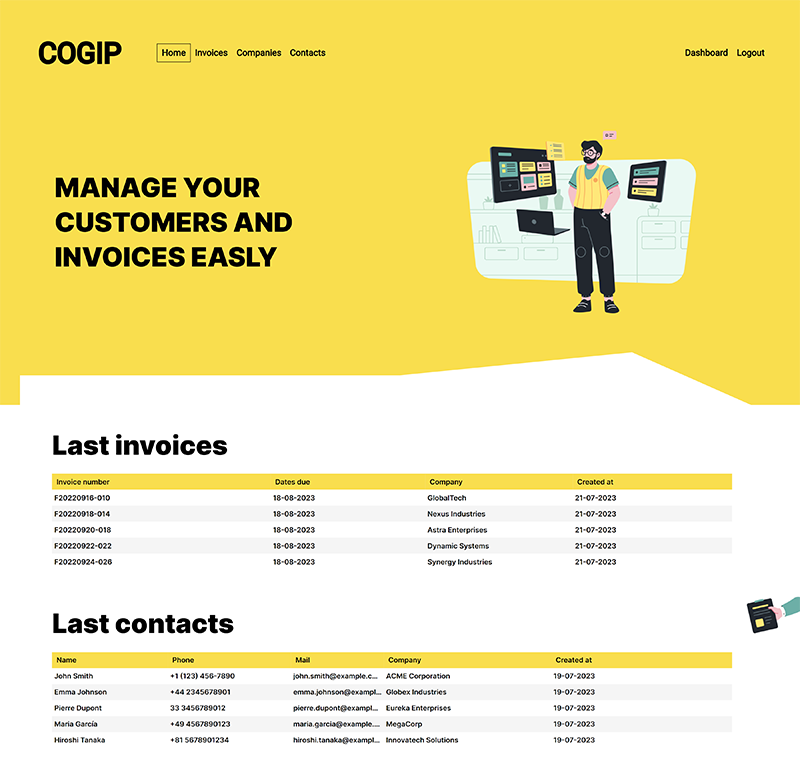

<h1 align="center">Cogip project</h1>

## About the project
### COGIP story
**COGIP** is a company that produces Jean-Michel toys. Jean-Christian Ranu works in accounting at the company. However, he has been using an old and incomplete software for years, forcing him to switch back and forth between it and Excel spreadsheets.

### Objectives
The aim of this project is to create a web application that will cater to the needs of Jean-Christian and, by extension, to the company COGIP.

*Front-end* developers will create a new design based on a Figma model. The design will be mobile-first and responsive for desktop versions..

*Back-end* developers will work on the functional aspect of the site: displaying data, enabling account creation and connection (for customers and providers), creation of an administrative interface, etc.

## Team Members
The project was collaboratively worked on by:

1. Thomas Moerman - *Back-end Developer* and *Project Manager* - [GitHub](https://github.com/ThomMoerman)
2. Jodie Addis - *Front-end Developer* - [GitHub](https://github.com/JodieAddis) 
3. Sylvain Jacobs - *Back-end Developer* - [GitHub](https://github.com/Alphit7)
4. Abel Fortunati - *Front-end Developer* - [GitHub](https://github.com/AbelF93)

## Coding Technologies Used
### **Back-end**:

### **Front-end**:

 
 
 
 
 

### **Version Control**:

### **Design**:

Figma was using to recreate the aesthetic of the website - [Figma Design](https://www.figma.com/file/PS5hPdhywkRfxreITOYwba/Cogip?type=design&node-id=15-463&mode=design&t=FCt9ucWf2tz98Bw5-0)